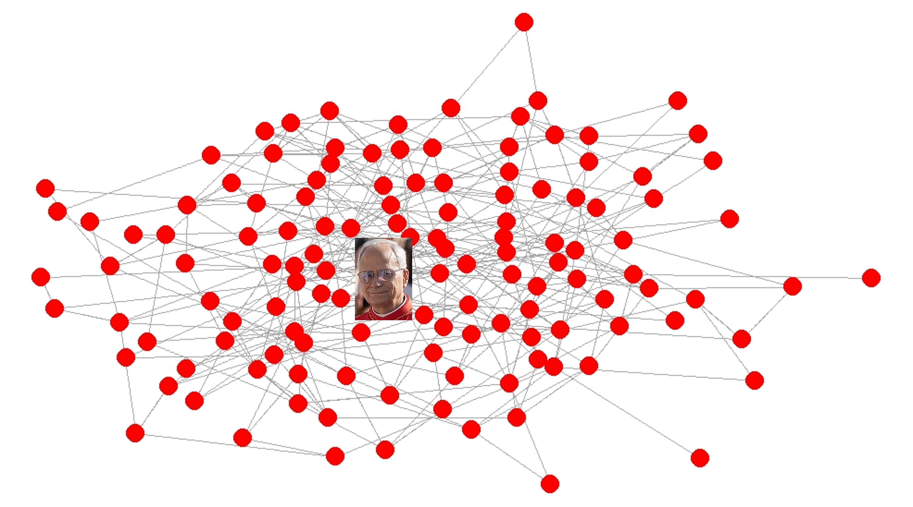
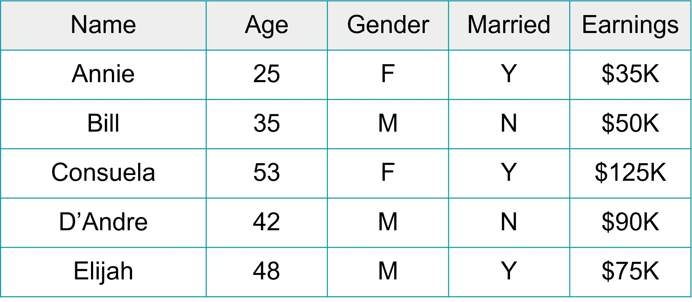
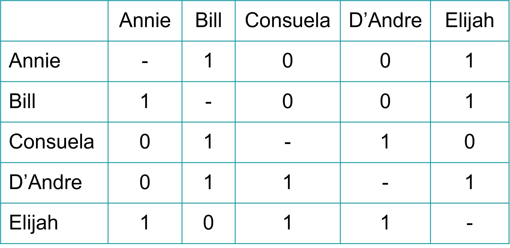

# What is Social Network Analysis?

To illustrate the benefits of social network analysis, let's begin with an example: the recent election of Pope Leo XIV to the papacy.

## Papacy Predictions

In May 2025, a new conclave began to replace the recently deceased Pope Francis. The new pope was to be selected from 133 cardinals, which represented the largest and most diverse conclave in history.[^intro_sna-1]

[^intro_sna-1]: Giuffrida, Angela. 2025. "Cardinals begin choosing new pope in largest ever conclave". The Guardian. May 7.

It was also the first conclave to have ever taken place while international digital prediction market platforms were in use. Betting on who the next pope would be was big business, with people spending more than \$40 million combined on the Polymarket and Kalshi platforms.[^intro_sna-2]

[^intro_sna-2]: Soda, Giuseppe, Alessandro Iorio, and Leonardo Rizzo. 2025. “In the Network of the Conclave: Social Connections and the Making of a Pope.” Social Networks 83:215–32.

On May 8, white smoke emerged from the Sistine Chapel and the world soon learned that Cardinal Robert Francis Prevost would become Pope Leo XIV. On the prediction markets, Prevost was not the odds on favorite. In fact, less than 1 percent of the bets had predicted him to be the next pope.

How did the world get the prediction so wrong? Divine intervention cannot be ruled out, yet there is another intriguing explanation for Prevost's selection. Much of the media narrative surrounding the enclave discussed the potential pontiffs in terms of their personal attributes, their position within the Catholic organizational hierarchy, or their unique geographic locations. Social scientists took a different approach, exploring the predictive power of the network of relationships among the cardinals.

Giuseppe Soda, Alessandro Iorio, and Leonardo Rizzo gathered data on the cardinals' connections to each other based on shared memberships in various collegial bodies and co-consecration groups.[^intro_sna-3] These memberships were used to construct a network of connections between the cardinals in the conclave -- a network that can be displayed on a graph with the cardinals as points and lines between them as relationships. A simple display of this network graph revealed what the prognosticators could not see: Cardinal Prevost was squarely in the center of the graph.

[^intro_sna-3]: Soda, Giuseppe, Alessandro Iorio, and Leonardo Rizzo. 2025. “In the Network of the Conclave: Social Connections and the Making of a Pope.” Social Networks 83:215–32.

{fig-align="center" width="750"}

## Analyzing Social Networks

Social network analysis (SNA) refers to the study of relationships between people or groups of people. This focus on relationships is distinct from traditional forms of social scientific analysis that examine individual attributes. For example, we might conduct a survey of people and ask them about themselves: What is your age? What is your gender? Are you married? How much money do you earn at your job?

Information such as this can be organized into a typical data matrix, with individual people along the rows and variables along the columns. Those variables represent the attributes of the people. For example, because Consuela told us that she is married, that means she is a carrier of that attribute. Attribute-based analysis implies that we can explain individual outcomes based on the characteristics of those individuals. For example, an economist might be interested in knowing how attributes like age, gender, and marital status are associated with earnings.

{fig-align="center" width="350"}

Much can be gleaned from the study of individual attributes, but, as we saw from the conclave example, a focus on individual attributes alone can lead to inaccurate predictions. This is because attribute-based approaches treat individuals as independent units -- D'Andre's attributes have no bearing on Consuela's earnings. In the real world, we know that relationships have a powerful influence on how people behave, how they view themselves, and how they are viewed by others.

Social network analysis is therefore distinct by relying on a relational approach. Instead of asking people about themselves, we might instead ask people who their friends are. The table below provides a simple example of relational data, whereby people are listed along the rows *and* the columns. The values in the matrix indicate whether or not a person said that they are friends with someone else. In this example, Consuela said that she is not friends with Annie (row 3, column 1 = 0), but that she is friends with Bill (row 3, column 2 = 1). The data in this matrix tell us about the relationships that people have with others -- rather than their individual attributes -- and these relationships are incredibly useful for understanding the social world.

{fig-align="center" width="350"}

## Power, Community, and Change

Relationships are important to study for many reasons. Below are three major issues commonly examined through the use of social network analysis.

### Power

Social network analysis allows us to identify the positioning of individuals within a network, which is helpful for understanding a person's power, prominence, popularity, and importance within that social system. Central actors (as opposed to peripheral actors) tend to garner advantages in their access to resources and control over those resources.

Research shows that network centrality is predictive of many positive outcomes for individuals. In the conclave example, Cardinal Prevost's high level of network centrality enhanced his status and popularity among the other cardinals, contributing to his successful papal candidacy. Identifying central network actors can also be an important tool for organizing. Hana Shepherd, Rebecca Roskill, Suresh Naidu, and Adam Reich showed that a union organizing campaign at Walmart doubled its recruitment goals by identifying and resourcing the most central actors within workplaces.[^intro_sna-4]

[^intro_sna-4]: Shepherd, Hana, Rebecca Roskill, Suresh Naidu, and Adam Reich. 2025. “Workplace Networks and the Dynamics of Worker Organizing.” Sociological Science 12:537–71.

### Community

SNA also reveals how people form subgroups, clusters, and cliques within networks. Through the use of community detection procedures, we can categorize individuals on the basis of the subgroups to which they belong. Subgroup membership is important to know, as it offers insight into shared identities and access to collective resources.

Community has been central in research on political party polarization. Waugh, Pei, Fowler, Mucha, & Porter used community detection to examine subgroups among members of Congress based on co-sponsorship of legislation.[^intro_sna-5] They observed a substantial hardening of subgroup boundaries over time. In the late 1950s, it was common to cross the political party spectrum to co-sponsor legislation; by the early 2000s, this practice was exceedingly rare.

[^intro_sna-5]: Waugh, A. S., Pei, L., Fowler, J. H., Mucha, P. J., & Porter, M. A. 2009. Party polarization in Congress: A network science approach. arXiv:0907.3509.

### Change

SNA is also useful for understanding how change occurs across a social system. The structure of relationships has a big impact on the extent to which things like information, ideas, and diseases spread. Whereas dense and overlapping connections facilitate rapid contagions, sparse and disconnected network components obstruct or impede flow. These processes can be observed and also simulated to generate predictions about potential future outcomes.

One example comes from the work of Peter Bearman, Jim Moody, and Kate Stovel.[^intro_sna-6] They examined the structure of romantic relationship networks among high schoolers. They observed uniquely sprawling "spanning tree" structures that were emerged from romantic relationship norms (specifically, the norm against dating your best friend's boyfriend). Using network simulations, they showed that these structures are a worst case scenario for the diffusion of sexually transmitted diseases.

[^intro_sna-6]: Bearman, Peter S., James Moody, and Katherine Stovel. 2004. “Chains of Affection: The Structure of Adolescent Romantic and Sexual Networks.” American Journal of Sociology 110(1):44–91.

## Moving Forward

The analysis chapters draw on further examples of network data that can be used to address questions of power, community, and change. But before turning to those chapters, we begin at the beginning -- with an introduction to network data and visualization techniques.

## References
